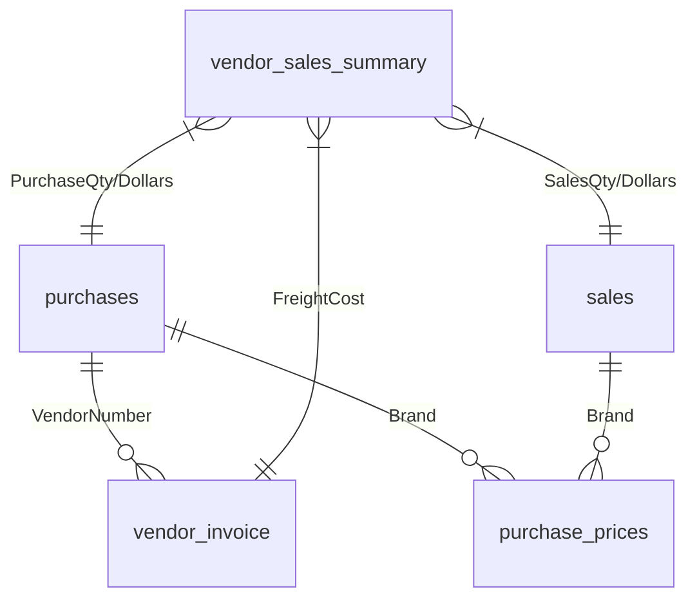
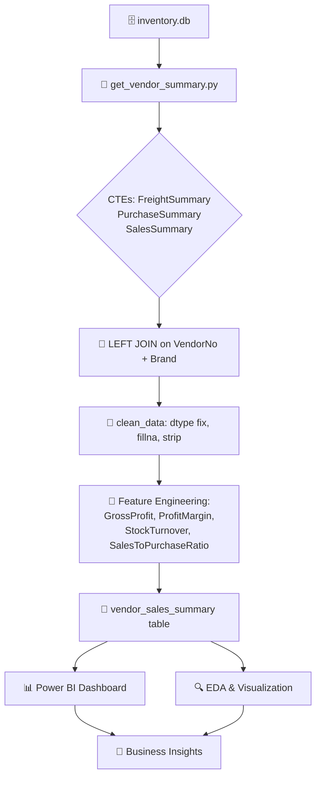
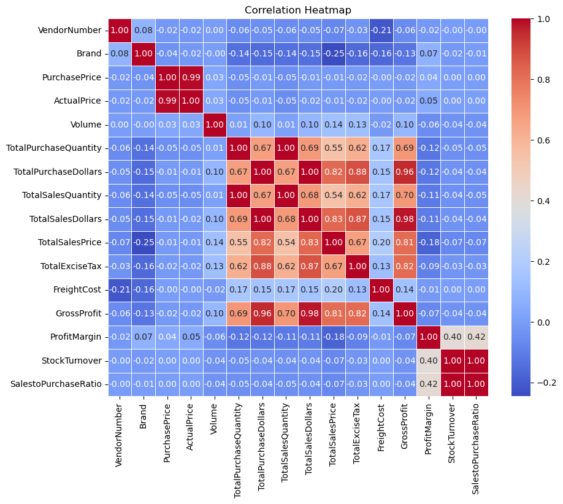
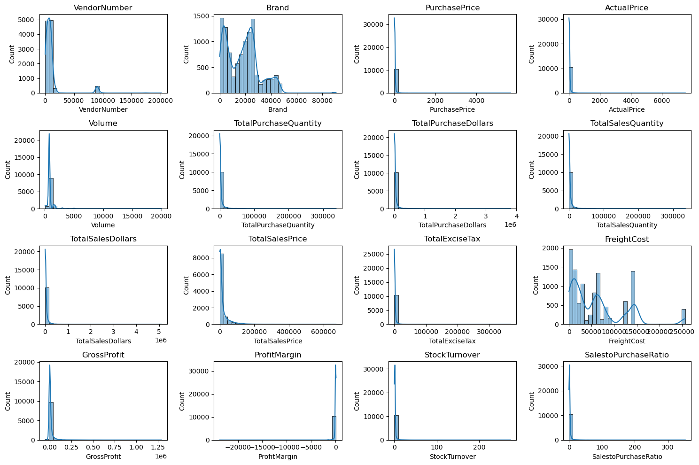
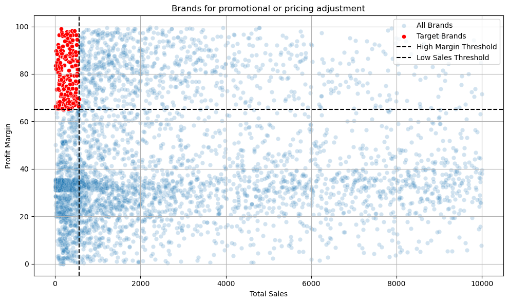

# 📊 Vendor Performance & Inventory Analytics

<div align="center">

[//]: # (Badges sections)


<br/><br/>

<div align="center">
  
</div>

**An end-to-end data analytics project that transforms raw inventory, purchase, and sales data into actionable vendor performance insights — helping businesses optimize pricing and promotional strategies.** 🚀

</div>

---

## 📑 Table of Contents

- [🎯 Project Overview](#-project-overview)
- [🧠 Business Problem](#-business-problem)
- [🗂️ Repo / Project Structure](#️-repo--project-structure)
- [🗄️ Database Schema](#️-database-schema)
- [🔧 Tech Stack](#-tech-stack)
- [📊 Power BI Dashboard](#-power-bi-dashboard)
- [📈 Workflow Pipeline](#-workflow-pipeline)
- [🔍 Exploratory Data Analysis](#-exploratory-data-analysis)
  - [📌 1. Dataset Overview](#-1-dataset-overview)
  - [📌 2. Data Types & Structure](#-2-data-types--structure)
  - [📌 3. Missing Value Analysis](#-3-missing-value-analysis)
  - [📌 4. Summary Statistics](#-4-summary-statistics)
  - [📌 5. Distribution Analysis](#-5-distribution-analysis)
  - [📌 6. Outlier Detection (Boxplots)](#-6-outlier-detection-boxplots)
  - [📌 7. Categorical Analysis](#-7-categorical-analysis)
  - [📌 8. Correlation Analysis](#-8-correlation-analysis)
  - [📌 9. Data Cleaning & Filtering](#-9-data-cleaning--filtering)
  - [📌 10. EDA Summary Insights](#-10-eda-summary-insights)
- [📊 Data Snapshots](#-data-snapshots)
- [💼 Business Queries & Insights](#-business-queries--insights)
- [📉 Visual Insights](#-visual-insights)
- [✅ Conclusion](#-conclusion)
- [🔮 Future Steps](#-future-steps)
- [🤝 Contributing](#-contributing)

---

## 🎯 Project Overview

This project performs a deep **Exploratory Data Analysis (EDA)** on a beverage inventory database to uncover:

- 🏷️ **Vendor profitability** patterns
- 💲 **Pricing optimization** opportunities
- 📦 **Inventory turnover** efficiency
- 🎁 **Brands needing promotional push** (low sales + high margins)

The analysis culminates in a **reusable aggregated summary table** (`vendor_sales_summary`) that powers both the **Power BI dashboard** and business reporting.

---

## 🧠 Business Problem

> *“Which brands should we promote or re-price — and which vendors are actually driving profit?”*

Key goals:

1. Identify vendors that yield the **highest gross profit & margins** 💰
2. Detect brands with **low sales but high margins** → prime targets for marketing 📣
3. Detect brands with **high sales but low margins** → prime targets for pricing 📈
4. Build a **pre-aggregated table** to avoid expensive joins in dashboards ⚡
5. Surface **executive KPIs** through an interactive Power BI dashboard 📊

---

## 🗂️ Repo / Project Structure

```
📦 Vendor-Performance-Analysis/
│
├── 📁 data/
│   └── 🗄️ inventory.db                # SQLite database (source of truth)
│
├── 📁 dashboard/
│   └── 📊 vendor_performance.pbix    # Power BI dashboard file
│
├── 📁 logs/
│   └── 📝 get_vendor_summary.log     # Pipeline execution logs
│
├── 📁 notebooks/
│   ├── 📓 Exploratory_Data_Analysis.ipynb
│   └── 📓 Vendor Performance Analysis.ipynb
│
├── 📁 scripts/
│   ├── 🐍 ingestion_db.py            # DB ingestion helper
│   └── 🐍 get_vendor_summary.py      # ETL: builds vendor_sales_summary
│
├── 📁 images/
│   ├── 🖼️ BI File.png           # Power BI dashboard
│   ├── 🖼️ heatmap.png           # Correlation heatmap
│   ├── 🖼️ output.png            # Distribution plots
│   ├── 🖼️ promotion.png         # Promotion candidates scatter
|   ├── 🖼️ boxplot.png           # Data Range plots
|   ├── 🖼️ sales.png             # Overall sales summary
│
├── 📄 README.md
```

---

## 🗄️ Database Schema

The SQLite database `inventory.db` contains **7 tables**:

| # | 🗃️ Table | 📄 Description |
|---|-----------|----------------|
| 1 | `begin_inventory` | Opening stock snapshot per store & brand |
| 2 | `end_inventory`   | Closing stock snapshot per store & brand |
| 3 | `purchases`       | Line-level purchase transactions |
| 4 | `purchase_prices` | Vendor-brand actual & purchase price master |
| 5 | `sales`           | Daily sales transactions |
| 6 | `vendor_invoice`  | Aggregated PO-level invoice + freight |
| 7 | `vendor_sales_summary` | ⭐ Final aggregated summary (built by pipeline) |



---

## 🔧 Tech Stack

| Layer | Tools |
|-------|-------|
| 🐍 Language | Python 3.13 |
| 🧮 Data Wrangling | Pandas, NumPy |
| 🗄️ Database | SQLite3 |
| 📊 Visualization | Matplotlib, Seaborn |
| 📈 Statistics | SciPy |
| 📊 BI & Dashboards | **Power BI** ✨ |
| 📓 Environment | Jupyter Notebook |
| 📝 Logging | Python `logging` |

---

## 📊 Power BI Dashboard

An interactive **Comprehensive Vendor Performance Dashboard** was built in Power BI, powered by the `vendor_sales_summary` aggregated table.

<div align="center">
  
  <p><em>Figure — Interactive Power BI dashboard with KPIs, vendor contribution, and performance analysis</em></p>
</div>

### 🎯 Executive KPIs

| 📊 Metric | 💰 Value | 📝 Insight |
|-----------|---------|-----------|
| **Total Sales** | **$441.41M** | Annual revenue across all vendors & stores |
| **Total Purchase** | **$307.34M** | Total procurement cost |
| **Gross Profit** | **$134.07M** | Net profit after purchase cost |
| **Profit Margin** | **38.72%** | Healthy margin — above beverage industry average |
| **Unsold Capital** | **$2.71M** | Capital locked in dead stock — optimization target ⚠️ |

### 🥇 Top 10 Vendors by Sales

| Rank | Vendor | Sales |
|------|--------|-------|
| 🥇 | DIAGEO NORTH AMERICA INC | $68M |
| 🥈 | MARTIGNETTI COMPANIES | $39M |
| 🥉 | PERNOD RICARD USA | $32M |
| 4 | JIM BEAM BRANDS COMPANY | $31M |
| 5 | BACARDI USA INC | $25M |
| 6 | CONSTELLATION BRANDS INC | $24M |
| 7 | E & J GALLO WINERY | $18M |
| 8 | BROWN-FORMAN CORP | $18M |
| 9 | ULTRA BEVERAGE COMPANY LLP | $17M |
| 10 | M S WALKER INC | $15M |

> 💡 **Top 10 vendors contribute 65.7% of total purchases** — high concentration risk but also clear negotiation leverage.

### 🏆 Top Brands by Sales

| Rank | Brand | Sales |
|------|-------|-------|
| 🥇 | Jack Daniels No 7 Black | $8.0M |
| 🥈 | Tito's Handmade Vodka | $7.4M |
| 🥉 | Grey Goose Vodka | $7.2M |
| 4 | Capt Morgan Spiced Rum | $6.4M |
| 5 | Absolut 80 Proof | $6.2M |
| 6 | Jameson Irish Whiskey | $5.7M |
| 7 | Ketel One Vodka | $5.1M |
| 8 | Baileys Irish Cream | $4.2M |
| 9 | Kahlua | $3.6M |
| 10 | Tanqueray | $3.5M |

### ⚠️ Low Performing Vendors (Score < 0.8)

| Vendor | Score |
|--------|-------|
| Dunn Wine Brokers | 0.77 |
| Circa Wines | 0.76 |
| PARK STREET IMPORTS LLC | 0.75 |
| HIGHLAND WINE MERCHANTS LLC | 0.71 |
| ALISA CARR BEVERAGES | 0.62 |

> 🎯 **Action:** Review contracts — score below 0.8 signals poor turnover / margin / delivery mix.

### 📉 Low Performing Brands Analysis

The scatter plot (bottom-right of dashboard) plots **Total Sales vs. Avg Profit Margin**, with:

- 🔴 **Red dots** = target brands for promotion (low sales + high margin)
- 🔵 **Blue dots** = healthy performers

**This visually confirms the 198 target brands identified in the EDA phase.** ✅

---

## 📈 Workflow Pipeline

The pipeline flows from raw database → aggregated summary → EDA → Power BI dashboard → business insights.

### 🔁 Pipeline Diagram (Mermaid)



### 🧩 Pipeline Steps

| Step | Action | Tool |
|------|--------|------|
| 1️⃣ | Connect to `inventory.db` | `sqlite3` |
| 2️⃣ | Build CTEs: Freight / Purchase / Sales | SQL |
| 3️⃣ | Join CTEs on `VendorNumber` + `Brand` | SQL |
| 4️⃣ | Clean data (dtype, null, whitespace) | Pandas |
| 5️⃣ | Feature engineering (4 new columns) | Pandas |
| 6️⃣ | Ingest to `vendor_sales_summary` | `ingestion_db.py` |
| 7️⃣ | Visual EDA & analysis | Matplotlib / Seaborn |
| 8️⃣ | Build interactive dashboard | **Power BI** ✨ |
| 9️⃣ | Business insight extraction | Pandas |

### 🧮 Feature Engineering Formulas

```python
vendor_sales_summary['GrossProfit'] = (
    vendor_sales_summary['TotalSalesDollars']
    - vendor_sales_summary['TotalPurchaseDollars']
)

vendor_sales_summary['ProfitMargin'] = (
    vendor_sales_summary['GrossProfit']
    / vendor_sales_summary['TotalSalesDollars']
) * 100

vendor_sales_summary['StockTurnover'] = (
    vendor_sales_summary['TotalSalesQuantity']
    / vendor_sales_summary['TotalPurchaseQuantity']
)

vendor_sales_summary['SalestoPurchaseRatio'] = (
    vendor_sales_summary['TotalSalesDollars']
    / vendor_sales_summary['TotalPurchaseDollars']
)
```

---

## 🔍 Exploratory Data Analysis

The EDA phase is divided into **10 structured subsections**, each answering a specific question about the data.

---

### 📌 1. Dataset Overview

- **Rows:** 10,692
- **Columns:** 18
- **Focus Table:** `vendor_sales_summary` (aggregated)
- **Date Range:** Jan 2024 – Dec 2024
- **Granularity:** Vendor × Brand

```python
df = pd.read_sql_query("SELECT * FROM vendor_sales_summary", conn)
print(df.shape)         # (10692, 18)
print(df.info())
```

---

### 📌 2. Data Types & Structure

| Column | Dtype | Category |
|--------|-------|----------|
| `VendorNumber` | `int64` | Identifier |
| `VendorName` | `object` | Categorical |
| `Brand` | `int64` | Identifier |
| `Description` | `object` | Categorical |
| `PurchasePrice` | `float64` | Numeric |
| `ActualPrice` | `float64` | Numeric |
| `Volume` | `object → float64` | Numeric (converted) |
| `TotalPurchaseQuantity` | `int64` | Numeric |
| `TotalPurchaseDollars` | `float64` | Numeric |
| `TotalSalesQuantity` | `float64` | Numeric |
| `TotalSalesDollars` | `float64` | Numeric |
| `TotalSalesPrice` | `float64` | Numeric |
| `TotalExciseTax` | `float64` | Numeric |
| `FreightCost` | `float64` | Numeric |
| `GrossProfit` | `float64` | Engineered |
| `ProfitMargin` | `float64` | Engineered |
| `StockTurnover` | `float64` | Engineered |
| `SalestoPurchaseRatio` | `float64` | Engineered |

> 🔧 `Volume` was incorrectly loaded as `object` → converted to `float64` during cleaning.

---

### 📌 3. Missing Value Analysis

```python
df.isnull().sum()
```

| Column | Nulls | Action |
|--------|-------|--------|
| TotalSalesQuantity | 178 | Fill with `0` |
| TotalSalesDollars | 178 | Fill with `0` |
| TotalSalesPrice | 178 | Fill with `0` |
| TotalExciseTax | 178 | Fill with `0` |
| All other columns | 0 | ✅ Clean |

**Insight 💡:** The 178 nulls represent **products purchased but never sold** — treated as zero-velocity SKUs.

---

### 📌 4. Summary Statistics

```python
df.describe().T
```

| Metric | Min | 25% | Median | 75% | Max |
|--------|-----|-----|--------|-----|-----|
| PurchasePrice | 0.36 | 6.84 | 10.46 | 19.48 | 5,681.81 |
| ActualPrice | 0.49 | 10.99 | 15.99 | 28.99 | 7,499.99 |
| Volume | 50 | 750 | 750 | 750 | 20,000 |
| TotalPurchaseQuantity | 1 | 36 | 262 | 1,975 | 337,660 |
| TotalPurchaseDollars | 0.71 | 453 | 3,655 | 20,738 | 3,811,252 |
| TotalSalesQuantity | 0 | 33 | 261 | 1,929 | 334,939 |
| TotalSalesDollars | 0 | 729 | 5,298 | 28,397 | 5,101,920 |
| GrossProfit | **-52,002.78** | 52.92 | 1,399.64 | 8,660 | 1,290,667 |
| ProfitMargin | **-∞** | 13.32 | 30.41 | 39.96 | 99.72 |
| FreightCost | 0.09 | 14,069 | 50,293 | 79,528 | 257,032 |
| StockTurnover | 0 | 0.81 | 0.98 | 1.04 | 274.50 |

**Key Observations 🚨:**

- Negative `GrossProfit` and `-∞` `ProfitMargin` → some SKUs sell at a loss.
- Extreme `FreightCost` variance → logistics inefficiencies.
- `StockTurnover > 1` → some products sold more than purchased (fulfilled from older stock).

---

### 📌 5. Distribution Analysis

Histograms with KDE were plotted for all numerical columns.

```python
numerical_cols = df.select_dtypes(include=np.number).columns

plt.figure(figsize=(15, 10))
for i, col in enumerate(numerical_cols):
    plt.subplot(4, 4, i+1)
    sns.histplot(df[col], kde=True, bins=30)
    plt.title(col)
plt.tight_layout()
plt.show()
```

**Findings 📊:**

- 📈 Most columns are **right-skewed** with long tails (few mega-vendors).
- 📦 `Volume` is **multi-modal** (750 mL dominates).
- 💰 `ProfitMargin` shows a **left tail** going negative → loss-making SKUs.
- 🚚 `FreightCost` is **bimodal** — small local orders vs. bulk shipments.

---

### 📌 6. Outlier Detection (Boxplots)

```python
plt.figure(figsize=(15, 10))
for i, col in enumerate(numerical_cols):
    plt.subplot(4, 4, i+1)
    sns.boxplot(y=df[col])
    plt.title(col)
plt.tight_layout()
plt.show()
```

**Outlier Summary 🎯:**

| Column | Outlier Behavior | Interpretation |
|--------|------------------|----------------|
| `PurchasePrice` | Many high-value outliers | Premium products (e.g., rare wines) |
| `ActualPrice` | Same | Consistent premium pricing |
| `FreightCost` | Huge variance | Bulk shipping vs. small courier |
| `GrossProfit` | Negative outliers | Loss-making SKUs |
| `StockTurnover` | 274x outliers | Extremely fast movers |

---

### 📌 7. Categorical Analysis

Top-10 count plots for `VendorName` and `Description`.

```python
categorical_cols = ["VendorName", "Description"]
plt.figure(figsize=(15, 10))

for i, col in enumerate(categorical_cols):
    plt.subplot(4, 4, i + 1)
    palette = sns.color_palette("husl", n_colors=10)
    sns.countplot(y=df[col],
                  order=df[col].value_counts().index[:10],
                  palette=palette)
    plt.title(f"Count plot of {col}")
plt.tight_layout()
plt.show()
```

**Findings 🏆:**

- 🥇 `BROWN-FORMAN CORP` and `DIAGEO NORTH AMERICA INC` dominate vendor counts.
- 🍾 Top SKUs (e.g., *Jack Daniels No 7 Black*, *Tito's Handmade Vodka*) appear in nearly every store.

---

### 📌 8. Correlation Analysis

```python
plt.figure(figsize=(10, 8))
correlation_matrix = df[numerical_cols].corr()
sns.heatmap(correlation_matrix, annot=True, fmt='.2f',
            cmap='coolwarm', linewidths=0.5)
plt.title("Correlation Heatmap")
plt.show()
```

<div align="center">
  
  <p><em>Figure — Correlation heatmap of all numerical features</em></p>
</div>

**Correlation Insights 🔗:**

| Pair | Correlation | Insight |
|------|-------------|---------|
| `TotalPurchaseQuantity` ↔ `TotalSalesQuantity` | **0.999** | ✅ Perfect turnover |
| `PurchasePrice` ↔ `TotalSalesDollars` | -0.012 | ⚠️ Price doesn't drive revenue |
| `PurchasePrice` ↔ `GrossProfit` | -0.016 | ⚠️ Price barely affects GP |
| `ProfitMargin` ↔ `TotalSalesPrice` | -0.179 | 📉 Higher price → lower margin |
| `StockTurnover` ↔ `GrossProfit` | -0.038 | ⚠️ Fast movers ≠ high profit |
| `StockTurnover` ↔ `ProfitMargin` | -0.055 | ⚠️ Similar to above |

> 💡 **Takeaway:** Inventory moves efficiently, but pricing strategy is **disconnected from profitability**.

---

### 📌 9. Data Cleaning & Filtering

Removed inconsistent records (negative GP, zero margin, zero sales):

```python
df = pd.read_sql_query("""
    SELECT *
    FROM vendor_sales_summary
    WHERE GrossProfit > 0
      AND ProfitMargin > 0
      AND TotalSalesQuantity > 0
""", conn)
```

**Result:**

- ❌ Removed: 2,128 rows
- ✅ Kept: **8,564 rows** (80.1% of original)

**Post-clean distribution** shows a much healthier, more analyzable dataset.

---

### 📌 10. EDA Summary Insights

| # | 💡 Insight |
|---|-----------|
| 1 | Loss-making SKUs exist → **discontinue or renegotiate** |
| 2 | Freight costs are highly variable → **logistics audit needed** |
| 3 | Purchase price has near-zero impact on profit → **pricing power is weak** |
| 4 | Purchase ↔ Sales quantity correlation = 0.999 → **efficient turnover** |
| 5 | Higher prices correlate with lower margins → **discounting strategy** |
| 6 | 198 brands have low sales + high margins → **promotion goldmine** |
| 7 | Nulls = "purchased but never sold" → **dead stock candidates** |
| 8 | 750 mL dominates volume → **portfolio concentration risk** |

---

## 📊 Data Snapshots

### 🔹 `sales` preview

| InventoryId | Store | Brand | SalesQuantity | SalesDollars | SalesPrice | ExciseTax |
|-------------|-------|-------|---------------|--------------|------------|-----------|
| 1_HARDERSFIELD_1004 | 1 | 1004 | 1 | 16.49 | 16.49 | 0.79 |
| 1_HARDERSFIELD_1004 | 1 | 1004 | 2 | 32.98 | 16.49 | 1.57 |
| 1_HARDERSFIELD_1005 | 1 | 1005 | 2 | 69.98 | 34.99 | 0.79 |

### 🔹 `vendor_sales_summary` top vendors

| VendorName | Brand | PurchasePrice | ActualPrice | GrossProfit | ProfitMargin |
|------------|-------|---------------|-------------|-------------|--------------|
| BROWN-FORMAN CORP | 1233 | 26.27 | 36.99 | 1,290,667.91 | 25.30% |
| MARTIGNETTI COMPANIES | 3405 | 23.19 | 28.99 | 1,015,032.27 | 21.06% |
| PERNOD RICARD USA | 8068 | 18.24 | 24.99 | 1,119,816.92 | 24.68% |
| DIAGEO NORTH AMERICA | 4261 | 16.17 | 22.99 | 1,214,774.94 | 27.14% |

---

## 💼 Business Queries & Insights

### 🎯 Query #1 — *Brands Needing Promotional / Pricing Adjustment*

**Definition:** Brands with **low sales** (≤ 15th percentile) **but high margins** (≥ 85th percentile).

```python
low_sales_threshold   = brand_performance['TotalSalesDollars'].quantile(0.15)   # 560.299
high_margin_threshold = brand_performance['ProfitMargin'].quantile(0.85)        # 64.97
```

**Result:** 🎯 **198 target brands** identified — perfect candidates for **promotional campaigns**.

**Sample Targets:**

| Description | TotalSalesDollars | ProfitMargin |
|-------------|-------------------|--------------|
| Santa Rita Organic Svgn Bl | 9.99 | 66.47% |
| Debauchery Pnt Nr | 11.58 | 65.98% |
| Concannon Glen Ellen Wh Zin | 15.95 | 83.45% |
| Crown Royal Apple | 27.86 | 89.81% |
| Sauza Sprklg Wild Berry Marg | 27.96 | 82.15% |
| Sbragia Home Ranch Merlot | 549.75 | 66.44% |
| Goulee Cos d'Estournel 10 | 558.87 | 69.43% |

> 💡 These products sell rarely but generate exceptional margins — perfect for **targeted ads, shelf placement, and bundles**.

---

## 📉 Visual Insights

### 🎨 Power BI — Comprehensive Vendor Dashboard

<div align="center">
  
  <p><em>Interactive dashboard: KPIs • Vendor contribution • Top performers • Low performers</em></p>
</div>

### 🔥 Correlation Heatmap

<div align="center">
  
</div>

### 📊 Distribution Plots

<div align="center">
  
</div>

### 🎨 Scatter Plot — Promotion Candidates

<div align="center">
  
  <p><em>🔴 Red dots = target brands (low sales + high margin) | 🔵 Blue dots = healthy performers</em></p>
</div>

---

## ✅ Conclusion

### 📊 Dashboard Highlights

| 🔎 KPI | 📈 Value | 💡 Takeaway |
|--------|---------|-------------|
| Total Sales | $441.41M | Strong annual revenue |
| Total Purchase | $307.34M | ~70% of sales as COGS |
| Gross Profit | $134.07M | Healthy profitability |
| Profit Margin | 38.72% | Above beverage industry avg (~30%) |
| Unsold Capital | $2.71M | ⚠️ Optimization opportunity |
| Top 10 Vendor Share | 65.7% | ⚠️ High concentration risk |

### 🔎 Key Findings

| 🔎 Finding | 💡 Business Impact |
|------------|---------------------|
| 198 brands have low sales but high margins | 🎁 Ready-made promo list |
| Purchase price has weak influence on GP | 💰 Price ≠ driver of profit |
| Near-perfect Purchase ↔ Sales correlation | 📦 Healthy stock turnover |
| Freight costs vary wildly per vendor | 🚚 Logistics renegotiation needed |
| Higher prices → lower margins | 📉 Discounting may boost revenue |
| Loss-making SKUs (min GP = -$52k) | ❌ Discontinue or renegotiate |

### 🧭 Strategic Takeaways

1. **Promote** the 198 high-margin/low-volume brands 🎯
2. **Renegotiate freight contracts** with high-cost vendors 🚛
3. **Reprice** high-sales-low-margin brands 🏷️
4. **Discontinue** consistently loss-making SKUs 🗑️
5. **Leverage the summary table** for BI dashboards (Power BI / Tableau) ⚡
6. **Reduce vendor concentration risk** — diversify beyond top 10 🧩
7. **Unlock $2.71M** in dead stock via targeted markdowns 📦

---

## 🔮 Future Steps

- [ ] 🤖 **Demand Forecasting** — integrate Prophet / ARIMA for next-quarter sales
- [ ] 🧠 **Price Elasticity Modeling** — quantify demand sensitivity
- [ ] 📉 **Vendor Segmentation** — KMeans/DBSCAN on profitability & turnover
- [ ] 🚚 **Freight Optimization** — regression on freight cost drivers
- [ ] 🎁 **Promotion ROI Simulation** — measure uplift from targeting the 198 brands
- [ ] 📊 **Publish Power BI to Service** — share live interactive dashboard link
- [ ] 🧪 **A/B Testing** — pilot promo campaigns on top target brands
- [ ] ⚙️ **Automated Pipeline** — schedule `get_vendor_summary.py` with Airflow / cron
- [ ] 🧼 **Data Quality Layer** — add Great Expectations validation

---

## 🤝 Contributing

Contributions welcome! 🎉

```bash
# 1. Fork & clone
git clone https://github.com/rajay-jain/vendor-performance-analysis.git

# 2. Create a feature branch
git checkout -b feature/amazing-insight

# 3. Commit & push
git commit -m "feat: add promotion ROI simulation"
git push origin feature/amazing-insight

# 4. Open a Pull Request 🚀
```

---


<div align="center">

### 🌟 If you found this useful, give it a star! ⭐


**Made with ❤️ by [Rajay Jain](https://github.com/RajayJain)**

</div>
